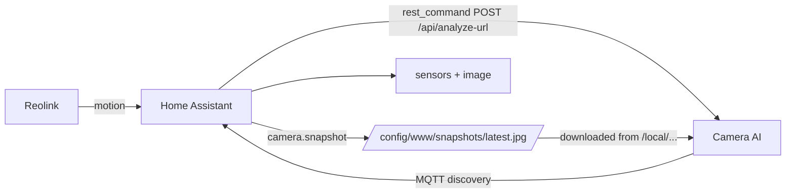

# Camera AI — Test GUI (YOLO + small vision LLM)

Local web app that tests the "Reolink motion → AI → result" pipeline **without the camera**:
upload pictures, YOLO detects objects, and a small local vision LLM describes the scene.

```
camera → snapshot (motion) → YOLO detection → small LLM description → result
```

## Installation

Två sätt att köra — Windows-appen är huvudversionen:

### Option 1 — Windows-app med GUI (rekommenderad)

Kör Camera AI som en Windows-app med eget GUI-fönster + taskbar/tray-ikon.
YOLO körs på **Intel Arc B50 Pro** via OpenVINO (`openvino:GPU` → `intel:gpu`),
och vision-LLM (Ollama) på Arc-kortet via **Vulkan** (`OLLAMA_VULKAN=1`).

1. Krav: Windows 10/11 eller Server 2025, **Intel Arc B50 Pro** med drivrutin,
   Python 3.12 (x64), Git och [Ollama](https://ollama.com).

2. Sätt upp:
   ```powershell
   git clone https://github.com/nikeng-forenade/camera_ai.git C:\camera_ai
   cd C:\camera_ai
   powershell -ExecutionPolicy Bypass -File windows\setup.ps1
   ```

3. Aktivera Vulkan för Ollama (Arc B50 Pro):
   - Sätt systemvariabeln `OLLAMA_VULKAN=1` och starta om Ollama.
   - Testa: `ollama run moondream` — Arc-kortet ska belastas.

4. Starta appen (GUI-fönster + tray-ikon; stäng = minimera till tray, avsluta via ikonen):
   ```powershell
   .\windows\start.bat
   ```
   Utan pywebview öppnas webbläsaren istället: `http://127.0.0.1:8000`.

5. Home Assistant: kopiera `custom_components/camera_ai` till HA:s
   `custom_components/`, lägg till integrationen med `http://<dator-ip>:8000`
   (appen lyssnar på `0.0.0.0`).

6. Uppdatera (ingen EXE-byggning):
   ```powershell
   powershell -ExecutionPolicy Bypass -File windows\update.ps1
   ```

Valfritt: kör som tjänst (headless) med `windows\install-service.ps1` (NSSM).

> **Gamla LXC/Docker-deploymenten** (Proxmox, Docker Compose, Intel iGPU
> passthrough) finns arkiverad under [`old/README-lxc.md`](old/README-lxc.md).

### Option 2 — Local dev (no Docker, Windows/macOS/Linux)

Requires Python 3.9+ and [Ollama](https://ollama.com).

```powershell
ollama pull moondream                      # small vision LLM (~1.9B, runs on CPU)
pip install -r requirements.txt
python app.py                              # open http://127.0.0.1:8000
```

### Bygga fristående EXE (valfritt)

På en Windows-maskin med Python 3.12 och repo klonat:

```powershell
powershell -ExecutionPolicy Bypass -File windows\build_exe.ps1          # onedir (snabb start)
powershell -ExecutionPolicy Bypass -File windows\build_exe.ps1 -OneFile # en enda fil
```

Resultat:
- onedir: `dist\CameraAI\CameraAI.exe` — flytta **hela mappen**.
- onefile: `dist\CameraAI.exe` — en enda fil (långsammare start).

Kopiera till datorn med Arc B50 Pro och kör. `.env`, `uploads/`, `media/` och
OpenVINO-modeller skapas automatiskt **bredvid exe:n**. Bygget ger ~1–2 GB.

## Quick start

```powershell
# 1. (optional) install the small vision LLM runtime
#    https://ollama.com — then pull a small vision model:
ollama pull moondream        # ~1.9B, runs on CPU

# 2. install deps
pip install -r requirements.txt

# 3. run
python app.py                # then open http://127.0.0.1:8000
```

The first YOLO run downloads the model (yolo11n.pt, ~6 MB) — needs internet once.

## Settings

| Setting | Where | Default |
|---|---|---|
| YOLO model | GUI dropdown / env `YOLO_MODEL` | `yolo11n.pt` |
| Confidence | GUI slider / env `YOLO_CONF` | `0.30` |
| Vision LLM | GUI checkbox / env `LLM_BACKEND` (`ollama` / `none`) | `ollama` |
| LLM model | env `OLLAMA_MODEL` | `moondream` |
| LLM server | env `OLLAMA_URL` | `http://localhost:11434` |

Small vision LLM options in Ollama: `moondream` (~1.9B, CPU-friendly) or `llava` (~7B).
If Ollama isn't running, YOLO detection still works — the description just shows an error.

## API

- `GET  /api/health` — model + LLM status
- `POST /api/analyze` — multipart `file` (+ optional `model`, `conf`, `use_llm`, `prompt`) → detections, annotated image URL, description

## Talk to Home Assistant

The app can push every analysis result to HA. Two transports — **no custom add-on needed**.

### MQTT + auto-discovery (recommended)
Entities appear in HA automatically — no YAML, no restart. This is the same mechanism Frigate uses.
1. In HA: **Settings → Devices & Services → MQTT** and install the **Mosquitto broker** add-on.
2. Create a `.env` file in this folder (see `example.env`) or export the env vars, then restart `python app.py`:
   ```
   HA_ENABLED=1
   HA_TRANSPORT=mqtt
   HA_MQTT_HOST=<home-assistant-ip-or-host>
   HA_MQTT_PORT=1883
   HA_MQTT_USER=<mqtt-user>
   HA_MQTT_PASS=<mqtt-pass>
   ```
3. Entities that appear in HA:
   - `binary_sensor.camera_ai_motion` — ON when objects detected
   - `sensor.camera_ai_last_detection` — classes + confidence (JSON)
   - `sensor.camera_ai_scene_description` — the LLM description
   - `image.camera_ai_snapshot` — the annotated picture

### REST API (alternative)
1. In HA: click your user → **Security → Long-lived access tokens** → create one.
2. `.env`:
   ```
   HA_ENABLED=1
   HA_TRANSPORT=rest
   HA_REST_URL=http://<home-assistant-ip>:8123
   HA_REST_TOKEN=<long-lived-token>
   ```
3. HA gets a `sensor.camera_ai_detection` state and fires a `camera_ai_result` event
   (automations can listen: `event_type: camera_ai_result`).

In the GUI tick **“Send results to Home Assistant”** to push each uploaded picture.
When wired to the camera, `reolink_motion.py` publishes the same results automatically on motion.

## HACS integration (custom component)

A full Home Assistant integration (`custom_components/camera_ai`) that talks to
the Camera AI server over its REST API and lets you pick the YOLO model etc.
from the HA UI — **no MQTT needed**.

### Install via HACS

1. In HACS: **Settings → Custom repositories** → add
   `https://github.com/nikeng-forenade/camera_ai`, category **Integration**.
   (For a *private* repo, add a GitHub **personal access token** in HACS settings.)
2. HACS → **Integrations** → search **Camera AI** → **Download** → restart HA.
3. **Settings → Devices & Services → Add integration → Camera AI** and set:
   - **Server URL** — `http://<server-ip>:8000`
   - **YOLO model** — dropdown (`yolo11n/s/m/l/x.pt`)
   - **Confidence**, **Use LLM**, **Camera entity**

Entities created:
- `sensor.camera_ai_server_status` — online/offline + active model
- `sensor.camera_ai_last_detection` — classes + confidence
- `sensor.camera_ai_scene_description` — the Swedish summary
- `binary_sensor.camera_ai_motion` — ON when people/cars/animals detected
- `camera.camera_ai_annotated_snapshot` — the annotated image

Services (choose model/confidence per call):
- `camera_ai.analyze_camera` — snapshot a camera and analyze it
- `camera_ai.analyze_url` — analyze an image URL

Example automation (motion → analyze):
```yaml
alias: "Camera AI — analysera på rörelse"
trigger:
  platform: state
  entity_id: binary_sensor.reolink_front_motion
  to: "on"
action:
  - service: camera_ai.analyze_camera
    data:
      camera_entity: camera.reolink_front
      model: yolo11s.pt
```

### Full flow: Reolink → HA saves snapshot → Camera AI → back to HA

This is the flow you described — the camera image ends up **saved on Home Assistant**,
then analysed, and the result comes back as HA entities.



1. **On the HA side**, copy `ha/rest_command.yaml` and `ha/automation.yaml`, replace the
   entity names and IPs, create `/config/www/snapshots`, and reload config/automations.
   On motion the automation:
   - `camera.snapshot` saves the Reolink picture to `/config/www/snapshots/latest.jpg`
     (visible at `http://<HA-IP>:8123/local/snapshots/latest.jpg`)
   - calls `rest_command.camera_ai_analyze` → POSTs that URL to
     `http://<server-ip>:8000/api/analyze-url`
2. **Camera AI** downloads the image, runs YOLO + the Swedish summary, and publishes the
   result back to HA over MQTT (auto-discovered entities).

## Next step: wire up the Reolink camera

The `analyzer.py` pipeline is the same one used by `reolink_motion.py`, which:
1. Pulls a snapshot from the Reolink HTTP API when motion is detected,
2. Runs YOLO + the LLM on it,
3. Pushes the result somewhere (MQTT → Home Assistant, or a webhook/notification).

Configure the camera via env vars: `REOLINK_HOST`, `REOLINK_USER`, `REOLINK_PASS`.
