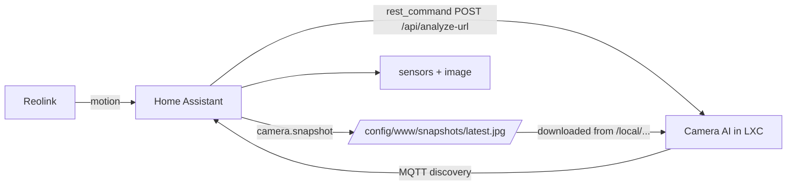

# Camera AI — Test GUI (YOLO + small vision LLM)

Local web app that tests the "Reolink motion → AI → result" pipeline **without the camera**:
upload pictures, YOLO detects objects, and a small local vision LLM describes the scene.

```
camera → snapshot (motion) → YOLO detection → small LLM description → result
```

## Quick start

```powershell
# 1. (optional) install the small vision LLM runtime
#    https://ollama.com — then pull a small vision model:
ollama pull moondream        # ~1.9B, runs on CPU

# 2. install deps
pip install -r requirements.txt

# 3. run
python app.py                # then open http://127.0.0.1:8000
```

The first YOLO run downloads the model (yolo11n.pt, ~6 MB) — needs internet once.

## Settings

| Setting | Where | Default |
|---|---|---|
| YOLO model | GUI dropdown / env `YOLO_MODEL` | `yolo11n.pt` |
| Confidence | GUI slider / env `YOLO_CONF` | `0.35` |
| Vision LLM | GUI checkbox / env `LLM_BACKEND` (`ollama` / `none`) | `ollama` |
| LLM model | env `OLLAMA_MODEL` | `moondream` |
| LLM server | env `OLLAMA_URL` | `http://localhost:11434` |

Small vision LLM options in Ollama: `moondream` (~1.9B, CPU-friendly) or `llava` (~7B).
If Ollama isn't running, YOLO detection still works — the description just shows an error.

## API

- `GET  /api/health` — model + LLM status
- `POST /api/analyze` — multipart `file` (+ optional `model`, `conf`, `use_llm`, `prompt`) → detections, annotated image URL, description

## Deploy in an LXC (Docker)

The whole stack (app **+ Ollama**) is containerised so it runs in an LXC
(e.g. on Proxmox) without running Ollama on the host machine.

### Recommended: paste-and-run on the Proxmox host (syslog_mini style)

Open the **Proxmox shell** and paste:

```bash
bash -c "$(wget -qLO - https://raw.githubusercontent.com/nikeng-forenade/camera_ai/main/lxc/proxmox-create.sh)"
```

It prompts for **Default** (DHCP, 2 cores, 4 GB RAM, 20 GB disk) or **Advanced**
(custom IP, CPU/RAM, Intel iGPU, Home Assistant, Reolink).

Non-interactive with options:

```bash
bash -c "$(wget -qLO - https://raw.githubusercontent.com/nikeng-forenade/camera_ai/main/lxc/proxmox-create.sh)" -- \
  200 local-lvm vmbr0 192.168.1.50/24 192.168.1.1 \
  --cores 4 --ram 8192 --disk 30 --igpu --ha-host 192.168.1.10
```

Script options:

| Argument | Default | Description |
|---|---|---|
| `<CT_ID> [STORAGE] [BRIDGE] [IP/CIDR] [GATEWAY]` | `200 local-lvm vmbr0 dhcp` | Container / network |
| `--disk GB` | `20` | Root disk |
| `--cores N` | `2` | vCPU cores |
| `--ram MB` | `4096` | Memory |
| `--igpu` | off | Pass through Intel iGPU (`/dev/dri`) |
| `--port`, `--model`, `--yolo-device`, `--llm-model` | `8000 yolo11s.pt cpu moondream` | App settings |
| `--ha-host`, `--ha-port`, `--ha-user`, `--ha-pass` | — | Home Assistant (MQTT discovery) |
| `--reolink-host`, `--reolink-user`, `--reolink-pass` | — | Reolink camera |

It creates the LXC, optionally wires up `/dev/dri`, pushes the project, and runs
`lxc/install.sh` (installs Docker, writes `.env`, `docker compose up -d --build`, pulls
moondream, sets up the iGPU).

Or clone + run locally (no GitHub needed):

```bash
git clone https://github.com/nikeng-forenade/camera_ai.git /tmp/camera_ai
cd /tmp/camera_ai && bash lxc/proxmox-create.sh 200
```

### Manual: copy project into an LXC

1. Create an LXC (Ubuntu 22.04/24.04, 4–8 GB RAM, 20 GB disk) and copy this project in.
2. Create `.env` next to `docker-compose.yml` (copy from `example.env`).
3. Start and pull the small vision model:
   ```
   docker compose up -d
   docker exec ollama ollama pull moondream
   ```
4. Open `http://<lxc-ip>:8000`.

Notes:
- **No GPU needed** for yolo11n/yolo11s + moondream on a few cameras (CPU is fine).
- If the LXC host has an NVIDIA GPU you *can* pass it through, but that's fiddly in LXC
  — a small VM is easier for GPU passthrough. For 1–3 cameras, CPU is usually enough.
- Reolink: run `docker exec camera-ai python reolink_motion.py` (with `REOLINK_*` in `.env`)
  to test the motion → snapshot → AI → HA flow, or wire it to Frigate/HA triggers.

### Intel iGPU passthrough (Quick Sync / OpenVINO)

To accelerate YOLO on the host's Intel iGPU from inside the LXC, there's a helper
script (`install_igpu.sh`) modeled on the community-scripts Frigate LXC helper.

1. On the Proxmox host, expose `/dev/dri` to the LXC — edit `/etc/pve/lxc/<id>.conf` and add:
   ```
   lxc.cgroup2.devices.allow: c 226:0 rwm
   lxc.cgroup2.devices.allow: c 226:128 rwm
   lxc.mount.entry: /dev/dri/renderD128 dev/dri/renderD128 none bind,optional,create=file
   lxc.mount.entry: /dev/dri/card0 dev/dri/card0 none bind,optional,create=file
   ```
   Restart the container. Then inside the LXC run:
   ```
   bash install_igpu.sh
   ```
   It verifies `/dev/dri`, installs the Intel drivers (`intel-opencl-icd`,
   `intel-media-va-driver`, `vainfo`, …), syncs the `video`/`render` GIDs with the
   host and fixes device permissions.

2. The `camera-ai` image already bundles **OpenVINO + Intel OpenCL**. Just enable it:
   ```
   # in .env
   YOLO_DEVICE=openvino:GPU
   ```

3. Restart the stack:
   ```
   docker compose up -d --force-recreate camera-ai
   ```
   and watch the inference time in the GUI drop.

Intel passthrough notes:
- The iGPU must already be enabled/usable on the Proxmox host (BIOS: enable iGPU).
- If `/dev/dri` is not exposed in the LXC, remove the `devices:` block from
  `docker-compose.yml` (CPU mode still works).
- Ollama has limited Intel iGPU support; `moondream` runs fine on CPU — the
  passthrough mainly speeds up YOLO via OpenVINO.

## Talk to Home Assistant

The app can push every analysis result to HA. Two transports — **no custom add-on needed**.

### MQTT + auto-discovery (recommended)
Entities appear in HA automatically — no YAML, no restart. This is the same mechanism Frigate uses.
1. In HA: **Settings → Devices & Services → MQTT** and install the **Mosquitto broker** add-on.
2. Create a `.env` file in this folder (see `example.env`) or export the env vars, then restart `python app.py`:
   ```
   HA_ENABLED=1
   HA_TRANSPORT=mqtt
   HA_MQTT_HOST=<home-assistant-ip-or-host>
   HA_MQTT_PORT=1883
   HA_MQTT_USER=<mqtt-user>
   HA_MQTT_PASS=<mqtt-pass>
   ```
3. Entities that appear in HA:
   - `binary_sensor.camera_ai_motion` — ON when objects detected
   - `sensor.camera_ai_last_detection` — classes + confidence (JSON)
   - `sensor.camera_ai_scene_description` — the LLM description
   - `image.camera_ai_snapshot` — the annotated picture

### REST API (alternative)
1. In HA: click your user → **Security → Long-lived access tokens** → create one.
2. `.env`:
   ```
   HA_ENABLED=1
   HA_TRANSPORT=rest
   HA_REST_URL=http://<home-assistant-ip>:8123
   HA_REST_TOKEN=<long-lived-token>
   ```
3. HA gets a `sensor.camera_ai_detection` state and fires a `camera_ai_result` event
   (automations can listen: `event_type: camera_ai_result`).

In the GUI tick **“Send results to Home Assistant”** to push each uploaded picture.
When wired to the camera, `reolink_motion.py` publishes the same results automatically on motion.

### Full flow: Reolink → HA saves snapshot → Camera AI → back to HA

This is the flow you described — the camera image ends up **saved on Home Assistant**,
then analysed, and the result comes back as HA entities.



1. **On the HA side**, copy `ha/rest_command.yaml` and `ha/automation.yaml`, replace the
   entity names and IPs, create `/config/www/snapshots`, and reload config/automations.
   On motion the automation:
   - `camera.snapshot` saves the Reolink picture to `/config/www/snapshots/latest.jpg`
     (visible at `http://<HA-IP>:8123/local/snapshots/latest.jpg`)
   - calls `rest_command.camera_ai_analyze` → POSTs that URL to
     `http://<LXC-IP>:8000/api/analyze-url`
2. **Camera AI** downloads the image, runs YOLO + the Swedish summary, and publishes the
   result back to HA over MQTT (auto-discovered entities).

## Next step: wire up the Reolink camera

The `analyzer.py` pipeline is the same one used by `reolink_motion.py`, which:
1. Pulls a snapshot from the Reolink HTTP API when motion is detected,
2. Runs YOLO + the LLM on it,
3. Pushes the result somewhere (MQTT → Home Assistant, or a webhook/notification).

Configure the camera via env vars: `REOLINK_HOST`, `REOLINK_USER`, `REOLINK_PASS`.

> Running it in an LXC (e.g. on Proxmox) later is a drop-in: same code, no GPU needed for
> yolo11n + moondream on a handful of cameras.
